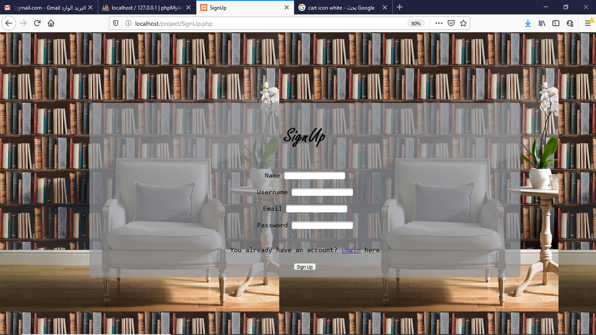
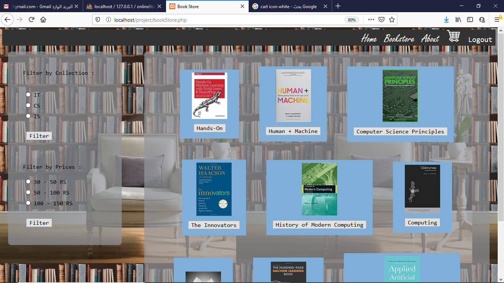
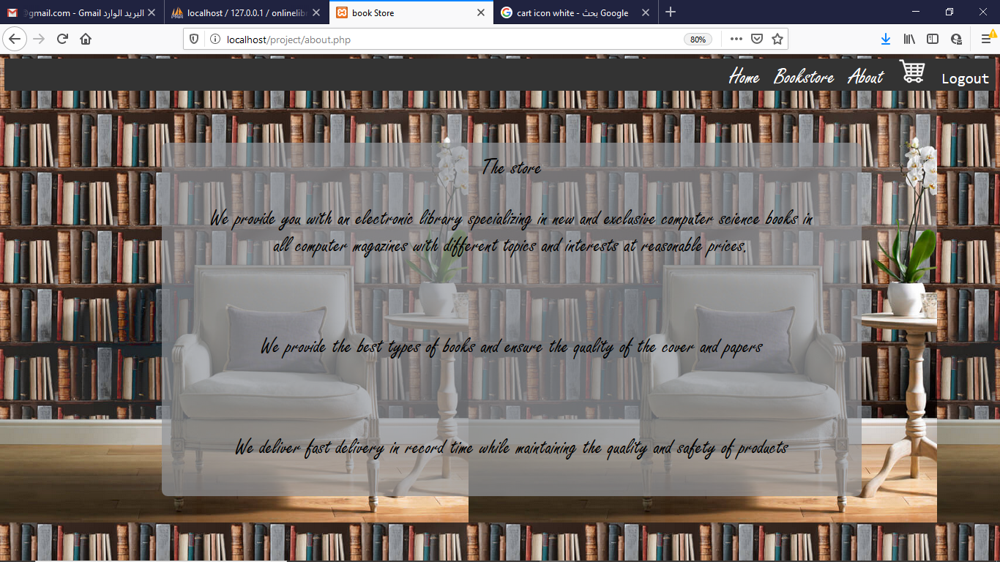
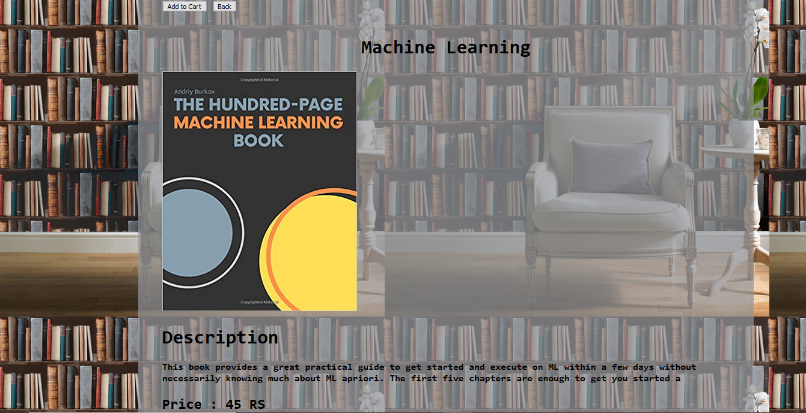
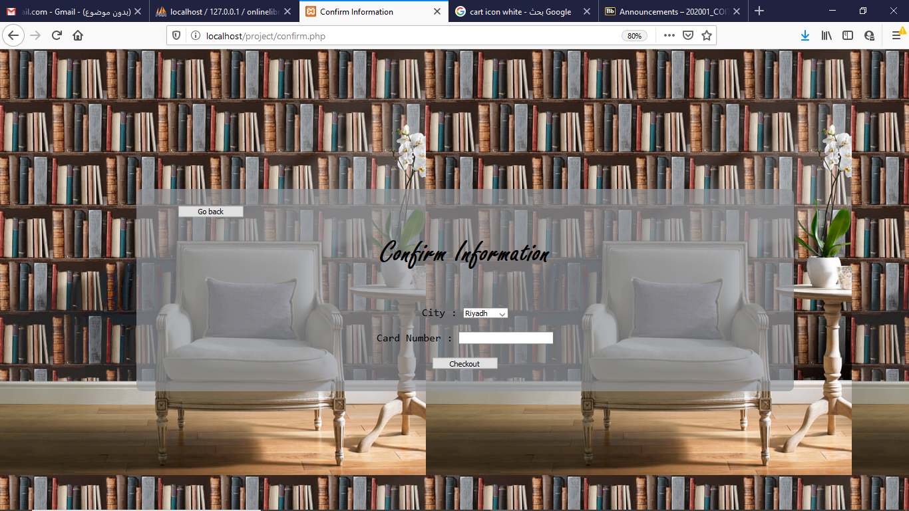
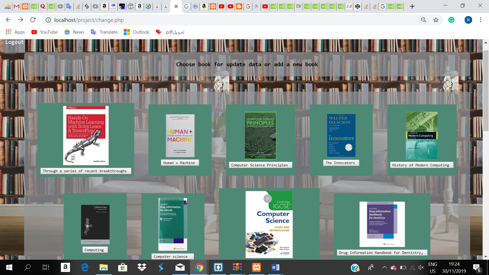
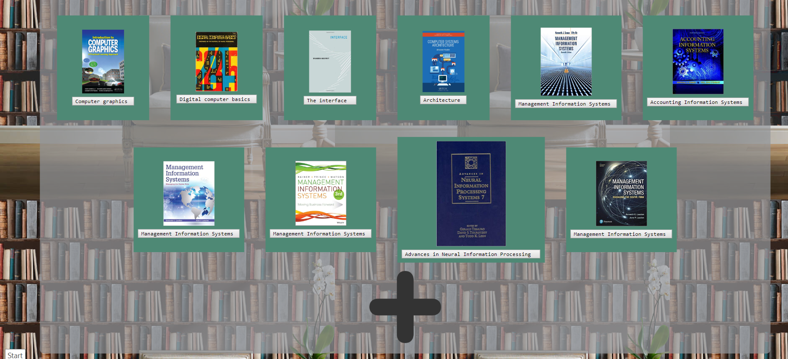
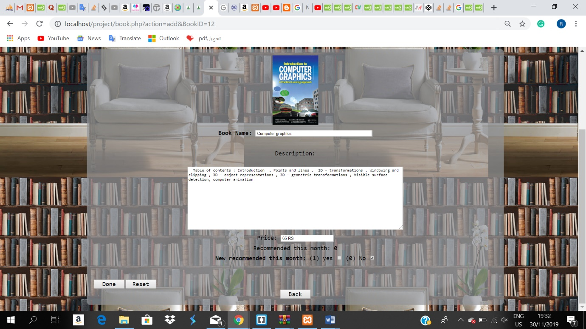
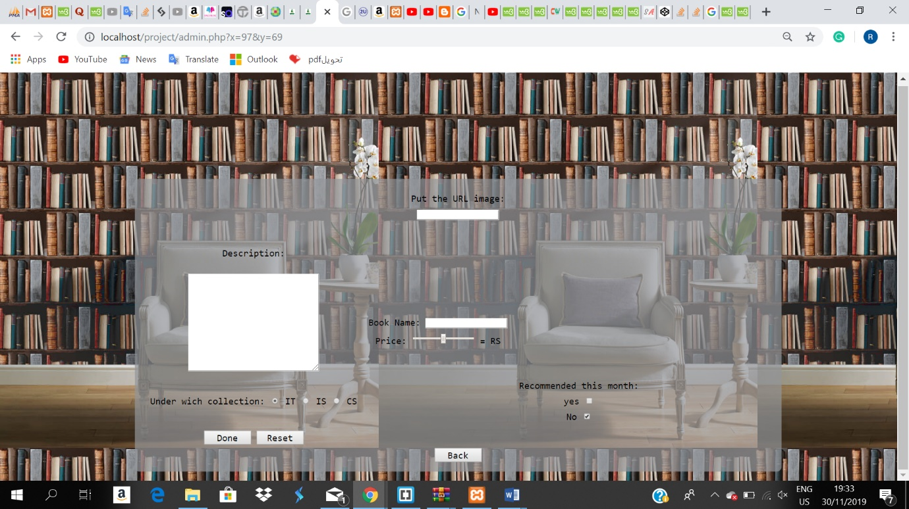

# OnlineBookStore
We have seen the need of online bookstore which specialized only on computer books , to help computer students .  So , we performed our website , it is composed of eleven pages , made by html, php and CSS languages . 

## Login :
the first page, you should have an account to access this page or you will get an error alert .

## Sign Up : 
if you do not have an account you can make one , password should be more than eight characters, or you will get an error alert .

## Home :
the main page, you can see the month’s recommended books and also you can recommend new books to let the admin provide it .

## Bookstore : 
all the books will be displayed so the customer can look for books and see the description of the books and take an idea for each book with the possibility of the customer to filter the results by categories and price .

## About : 
shows customers information about the idea of the website , how it works and what is the website features to help the customer to use it .

## Book Information : 
This page is responsible for displaying the book you want to buy and its price and then adding it to the shopping bag , you will get an alert to make sure the book has added .

## Cart : 
all books those have added to the cart will be displayed on the cart page as bill so the customer can know the price of each book and the total price of the books and then confirm the purchase order

## Confirmation : 
This page is responsible for confirming the information by entering your card number and your city where you want to receive the order and then will be stored in the database.

## This page is the last page 
that shows a phrase of thanks to the visitor and offers them the possibility to return to the home page .

# If you login by the admin account, you will be able to add new books or even modify information’s books :

## The first page in the Admin:
shows all books if he wants to change some content in the books or add a new book. 

## On this page you can change the name,  description, price, and if the book becomes recommended or not . 

## On this page, you can add a new book. 

